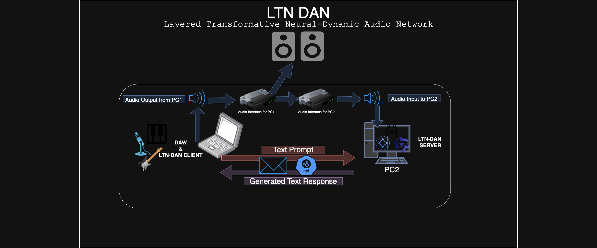
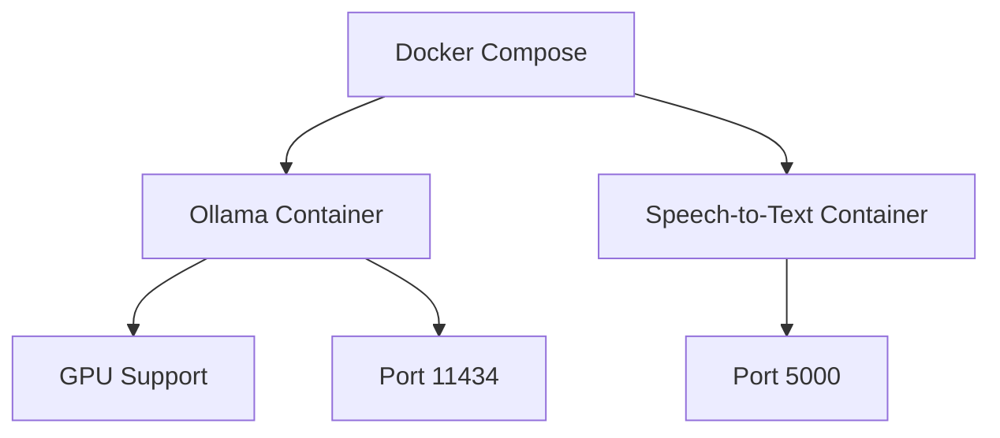

# LTN-DAN: Distributed Speech-to-Text AI Assistant

<div align="center">


*A distributed application that provides real-time speech-to-text transcription and AI-powered conversation capabilities across two machines.*

</div>

## 🏗️ Architecture

This project is designed to run on **two separate machines**:

- **Server Machine**: Handles speech-to-text transcription using Whisper and AI responses using Ollama
- **Client Machine**: Provides the web interface for user interaction

### System Architecture Diagram

<div align="center">



*Complete system architecture showing the interaction between client and server machines*

</div>

### Detailed Architecture Overview

```
┌─────────────────────────────────────────────────────────────────────────────────┐
│                              LTN-DAN Architecture                               │
└─────────────────────────────────────────────────────────────────────────────────┘

┌─────────────────┐    HTTP/WebSocket    ┌─────────────────┐
│   Client        │ ◄──────────────────► │   Server        │
│   Machine       │                      │   Machine       │
│                 │                      │                 │
│ ┌─────────────┐ │                      │ ┌─────────────┐ │
│ │   Web UI    │ │                      │ │   Whisper   │ │
│ │  (Port 3000)│ │                      │ │   STT       │ │
│ └─────────────┘ │                      │ └─────────────┘ │
│                 │                      │                 │
│ ┌─────────────┐ │                      │ ┌─────────────┐ │
│ │ Socket.IO   │ │                      │ │   Ollama    │ │
│ │  Client     │ │                      │ │   AI        │ │
│ └─────────────┘ │                      │ └─────────────┘ │
│                 │                      │                 │
│ ┌─────────────┐ │                      │ ┌─────────────┐ │
│ │ Audio       │ │                      │ │ Audio       │ │
│ │ Capture     │ │                      │ │ Processing  │ │
│ └─────────────┘ │                      │ └─────────────┘ │
└─────────────────┘                      └─────────────────┘
```

**Data Flow:**
1. 🎤 User speaks → Audio captured on Client
2. 📡 Audio sent to Server → Whisper transcribes
3. 🤖 Text sent to Ollama → AI generates response
4. 💬 Response streamed back to Client → Displayed in UI

**Ports:**
- Client: `3000` (Web UI)
- Server: `5000` (Speech API), `11434` (Ollama)

## 🚀 Features

<div align="center">

| Feature | Description | Status |
|---------|-------------|--------|
| 🎤 **Real-time Speech-to-Text** | Uses OpenAI Whisper for accurate audio transcription | ✅ |
| 🤖 **AI Chat Interface** | Powered by Ollama with support for various language models | ✅ |
| 🌐 **Web-based UI** | Modern interface with real-time message streaming | ✅ |
| 📚 **Conversation History** | Persistent chat history with JSON storage | ✅ |
| 🛡️ **Rate Limiting** | Built-in protection against abuse | ✅ |
| 🐳 **Docker Support** | Easy deployment with Docker and Docker Compose | ✅ |
| 🔄 **Cross-platform** | Works on Windows, macOS, and Linux | ✅ |

</div>

## 📋 Prerequisites

### Server Machine Requirements
- 🐍 Python 3.8+
- 🎮 CUDA-capable GPU (recommended for faster Whisper processing)
- 🤖 Ollama installed and running
- 💾 At least 8GB RAM (16GB+ recommended)

### Client Machine Requirements
- 🐍 Python 3.8+
- 🌐 Modern web browser
- 🌍 Network connectivity to server machine
- 💾 At least 4GB RAM

## 🛠️ Installation

### Server Machine Setup

<div align="center">

```
┌─────────────────────────────────────────────────────────────────────────────────┐
│                              SERVER MACHINE                                     │
└─────────────────────────────────────────────────────────────────────────────────┘

1. Install Dependencies
   ┌─────────────────┐
   │ pip install     │
   │ -r requirements │
   └─────────────────┘

2. Install Ollama
   ┌─────────────────┐
   │ curl -fsSL      │
   │ ollama.ai/      │
   │ install.sh | sh │
   └─────────────────┘

3. Start Services
   ┌─────────────────┐
   │ ollama serve    │
   │ python app.py   │
   └─────────────────┘
```

</div>

1. **Clone the repository:**
   ```bash
   git clone <repository-url>
   cd LTN-DAN/server
   ```

2. **Install Python dependencies:**
   ```bash
   pip install -r requirements.txt
   ```

3. **Install and start Ollama:**
   ```bash
   # Download and install Ollama
   curl -fsSL https://ollama.ai/install.sh | sh
   
   # Start Ollama service
   ollama serve
   
   # Pull a model (e.g., qwen2.5:7b)
   ollama pull qwen2.5:7b
   ```

4. **Configure the server:**
   Edit `config.py` to match your setup:
   ```python
   # Update the client UI URL to match your client machine's IP
   CHATBOT_UI_URL = "http://YOUR_CLIENT_IP:3000"
   ```

5. **Start the server:**
   ```bash
   python app.py
   ```

### Client Machine Setup

<div align="center">

```
┌─────────────────────────────────────────────────────────────────────────────────┐
│                              CLIENT MACHINE                                     │
└─────────────────────────────────────────────────────────────────────────────────┘

1. Install Dependencies
   ┌─────────────────┐
   │ pip install     │
   │ -r requirements │
   └─────────────────┘

2. Configure Environment
   ┌─────────────────┐
   │ Create .env     │
   │ file with       │
   │ server URLs     │
   └─────────────────┘

3. Start Client
   ┌─────────────────┐
   │ python app.py   │
   │ Open browser    │
   │ localhost:3000  │
   └─────────────────┘
```

</div>

1. **Navigate to the client directory:**
   ```bash
   cd LTN-DAN/client
   ```

2. **Install Python dependencies:**
   ```bash
   pip install -r requirements.txt
   ```

3. **Create environment configuration:**
   Create a `.env` file in the client directory:
   ```env
   OLLAMA_HOST=http://YOUR_SERVER_IP:11434
   DEFAULT_MODEL=qwen2.5:7b
   SPEECH_SERVER_URL=http://YOUR_SERVER_IP:5000
   HISTORY_FILE=conversation_history.json
   MAX_HISTORY_LENGTH=100
   DEFAULT_SYSTEM_PROMPT=You are a helpful AI assistant.
   SECRET_KEY=your-secret-key-here
   ```

4. **Start the client:**
   ```bash
   python app.py
   ```

## 🐳 Docker Deployment

### Server Machine (Docker)

<div align="center">



</div>

1. **Navigate to server directory:**
   ```bash
   cd LTN-DAN/server
   ```

2. **Build and run with Docker Compose:**
   ```bash
   docker-compose up -d
   ```

This will automatically:
- 🐳 Start Ollama with GPU support
- 🔨 Build and run the speech-to-text service
- 🌐 Expose the necessary ports

### Client Machine (Docker)

1. **Create a Dockerfile for the client:**
   ```dockerfile
   FROM python:3.9-slim
   
   WORKDIR /app
   COPY requirements.txt .
   RUN pip install -r requirements.txt
   
   COPY . .
   
   EXPOSE 3000
   CMD ["python", "app.py"]
   ```

2. **Build and run:**
   ```bash
   docker build -t ltn-dan-client .
   docker run -p 3000:3000 --env-file .env ltn-dan-client
   ```

## 🔧 Configuration

### Server Configuration (`server/config.py`)

<div align="center">

| Setting | Description | Default |
|---------|-------------|---------|
| `SERVER_URL` | Server's own URL | `http://localhost:5000` |
| `CHATBOT_UI_URL` | Client machine's URL | `http://192.168.1.197:3000` |
| `SAMPLE_RATE` | Audio sample rate | `16000` |
| `CHANNELS` | Audio channels | `1` |
| `WHISPER_MODEL_SIZE` | Whisper model to use | `distil-large-v2` |
| `WHISPER_DEVICE` | Processing device | `cuda` |

</div>

### Client Configuration (`.env` file)

<div align="center">

| Variable | Description | Required |
|----------|-------------|----------|
| `OLLAMA_HOST` | Ollama server URL | ✅ Yes |
| `DEFAULT_MODEL` | Ollama model name | ✅ Yes |
| `SPEECH_SERVER_URL` | Speech server URL | ✅ Yes |
| `HISTORY_FILE` | History file path | ❌ No |
| `MAX_HISTORY_LENGTH` | Max history entries | ❌ No |
| `DEFAULT_SYSTEM_PROMPT` | AI system prompt | ❌ No |
| `SECRET_KEY` | Flask secret key | ❌ No |

</div>

## 🌐 Usage

<div align="center">

```
┌─────────────────────────────────────────────────────────────────────────────────┐
│                              NETWORK CONNECTION                                 │
└─────────────────────────────────────────────────────────────────────────────────┘

Client (Port 3000) ←→ Server (Ports 5000, 11434)
     ↑                      ↑
  Web Browser         Whisper + Ollama
```

</div>

1. **Start both machines** following the installation instructions above
2. **Open your web browser** and navigate to `http://YOUR_CLIENT_IP:3000`
3. **Use the interface** to:
   - 💬 Send text messages to the AI
   - 🎤 Record audio for speech-to-text transcription
   - 📚 View conversation history
   - 🗑️ Clear conversation history

## 📡 API Endpoints

### Server Endpoints

<div align="center">

| Endpoint | Method | Description |
|----------|--------|-------------|
| `/transcribe` | `POST` | Transcribe audio file |
| `/status` | `GET` | Get server and Ollama status |
| `/test_ollama` | `GET` | Test Ollama connection |

</div>

### Client Endpoints

<div align="center">

| Endpoint | Method | Description |
|----------|--------|-------------|
| `/` | `GET` | Main web interface |
| `/start_recording` | `POST` | Start audio recording |
| `/stop_recording` | `POST` | Stop audio recording |
| `/check_recording_status` | `GET` | Check recording status |
| `/api/message` | `POST` | Send text message to AI |

</div>

### WebSocket Events

<div align="center">

| Event | Direction | Description |
|-------|-----------|-------------|
| `send_message` | Client → Server | Send message to AI |
| `receive_message` | Server → Client | Receive AI response |
| `load_history` | Client → Server | Load conversation history |
| `clear_history` | Client → Server | Clear conversation history |

</div>

## 🔍 Troubleshooting

### Common Issues

<div align="center">

| Issue | Solution |
|-------|----------|
| 🔌 **Ollama connection failed** | Ensure Ollama is running on the server machine |
| 🐌 **Whisper model loading slow** | Use a smaller model like `base` or `small` |
| 🎤 **Audio recording issues** | Check microphone permissions in your browser |
| 🐳 **Docker GPU issues** | Ensure NVIDIA Docker runtime is installed |

</div>

1. **Ollama connection failed:**
   - Ensure Ollama is running on the server machine
   - Check that the `OLLAMA_HOST` URL is correct
   - Verify network connectivity between machines

2. **Whisper model loading slow:**
   - Ensure you have sufficient RAM (8GB+ recommended)
   - Use a smaller model like `base` or `small` for faster loading
   - Consider using GPU acceleration if available

3. **Audio recording issues:**
   - Check microphone permissions in your browser
   - Ensure the speech server is accessible from the client
   - Verify the `SPEECH_SERVER_URL` configuration

4. **Docker GPU issues:**
   - Ensure NVIDIA Docker runtime is installed
   - Check that your GPU supports CUDA
   - Verify Docker Compose GPU configuration

### Logs and Debugging

- 📝 Server logs are displayed in the terminal where `app.py` is running
- 🌐 Client logs are available in the browser's developer console
- 🐳 Check Docker logs with `docker-compose logs` for containerized deployments

## 🤝 Contributing

<div align="center">

```
┌─────────────────────────────────────────────────────────────────────────────────┐
│                              Contributing                                       │
└─────────────────────────────────────────────────────────────────────────────────┘

1. Fork the repository
2. Create a feature branch
3. Make your changes
4. Add tests if applicable
5. Submit a pull request
```

</div>

1. Fork the repository
2. Create a feature branch
3. Make your changes
4. Add tests if applicable
5. Submit a pull request

## 📄 License

This project is licensed under the MIT License - see the [LICENSE](LICENSE) file for details.

## 🙏 Acknowledgments

<div align="center">

| Technology | Purpose |
|------------|---------|
| [OpenAI Whisper](https://github.com/openai/whisper) | Speech-to-text capabilities | 
| [Ollama](https://ollama.ai/) | Local AI model inference |
| [Flask](https://flask.palletsprojects.com/) | Web framework |
| [Socket.IO](https://socket.io/) | Real-time communication |

</div>

---

<div align="center">

**Made with ❤️ for the AI community**

[](https://github.com/yourusername/LTN-DAN)
[](https://github.com/yourusername/LTN-DAN)
[](https://github.com/yourusername/LTN-DAN/issues)

</div> 
